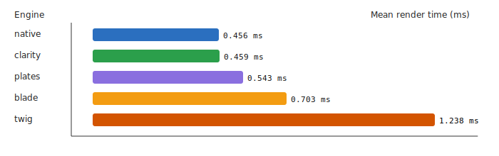

# Clarity Template Engine


> **A fast, secure, and expressive PHP template engine** – Clarity compiles `.clarity.html` templates into cached PHP classes for maximum performance while maintaining a sandboxed, secure execution environment.

---

## ✨ Features

- **Compiled & Cached** – Templates compile to PHP classes and leverage OPcache for blazing-fast rendering
- **Secure Sandbox** – No arbitrary PHP execution; templates are strictly sandboxed with controlled access
- **Expressive Syntax** – Clean, readable template syntax inspired by modern template engines
- **Template Inheritance** – Reusable layouts with `extends` and `blocks` for DRY template architecture
- **Macros** – Define reusable template fragments with parameters and call them inline
- **Extensible** — Custom filters, functions, inline filters, block directives, and loader plugins
- **Modules** – Bundle filters, functions, and directives into self-registering plug-ins
- **Auto-escaping** – Built-in XSS protection with context-aware automatic HTML/JS/CSS escaping
- **Unicode Support** – Full multibyte string handling with transparent normalization
- **Zero Dependencies** – Standalone engine with no external dependencies beyond PHP 8.1+

---

## 📦 Installation

```bash
composer require sailantis/clarity-engine
```

**Requirements:** PHP 8.1 or higher

---

## 🚀 Quick Start

### Basic Setup

```php
<?php
require_once 'vendor/autoload.php';

use Clarity\ClarityEngine;

// Initialize the engine
$engine = new ClarityEngine([
    'viewPath'   => __DIR__ . '/templates',
    'namespaces' => [
        'admin'  => __DIR__ . '/templates/admin',
        'emails' => __DIR__ . '/templates/emails',
    ],
]);

// Render a template
echo $engine->render('welcome', [
    'title' => 'Welcome to Clarity',
    'user' => ['name' => 'Developer']
]);
```

### Your First Template

**templates/welcome.clarity.html:**

```twig
<!DOCTYPE html>
<html>
  <head>
    <title>{{ title }}</title>
  </head>
  <body>
    <h1>Hello, {{ user.name }}!</h1>
    <p>The current time is {{ "now" |> date("H:i:s") }}</p>
  </body>
</html>
```

That's it! Clarity automatically compiles and caches your template.

---

## 📚 Documentation

### For Template Authors

Start here if you're writing templates:

- **[Getting Started](docs/00-getting-started.md)** – Installation, setup, and your first template
- **[Template Syntax](docs/01-template-syntax.md)** – Variables, directives, operators, and control flow
- **[Filters & Functions](docs/02-filters-and-functions.md)** – Transform data with built-in and custom filters
- **[Layout Inheritance](docs/03-layout-inheritance.md)** – Reusable layouts with extends and blocks

### For Developers

Integration and advanced topics:

- **[Advanced Topics](docs/04-advanced-topics.md)** – Namespaces, caching, auto-escaping, and Unicode
- **[Best Practices](docs/05-best-practices.md)** – Organization, security, performance, and testing
- **[Troubleshooting](docs/06-troubleshooting.md)** – Common errors and debugging techniques

### Reference

- **[API Documentation](docs/api/)** – Auto-generated API reference for all classes
- **[Examples](docs/examples/)** – Runnable template examples demonstrating features
- **[Guide Index](docs/README.md)** – Complete documentation index

---

### Output & Variables

```twig
{{ expression }}              {# Output with auto-escaping #}
{{ expression |> raw }}       {# Output raw HTML (no escaping) #}
{{ user.name }}               {# Dot notation #}
{{ items[0] }}                {# Bracket notation #}
{{ firstName ~ ' ' ~ lastName }} {# String concatenation #}
```

### Control Flow

```twig
.........


  {{ item.name }}


         {# Loop with key variable #}
  {{ key }}: {{ value }}


{{ i }}        {# Range: 1 to 10 (inclusive) #}
{{ i }}       {# Range: 1 to 9 (exclusive) #}
{{ i }} {# With step #}


```

### Macros

```twig

<div class="card"><h3>{{ title }}</h3><p>{{ body }}</p></div>




```

### Filters

```twig
{{ text |> upper }}
{{ price |> number(2) }}
{{ timestamp |> date('Y-m-d H:i') }}
{{ "Hello, %s!" |> sprintf(user.name) }}
{{ tags |> join(', ') }}
{{ users |> map(u => u.name) |> join(', ') }} {# Lambda expression #}
{{ items |> filter(i => i.active) |> length }}
{{ title |> slug }}                           {# URL-friendly slug #}
{{ html |> striptags }}                       {# Strip HTML tags #}
```

Common filters: `upper`, `lower`, `trim`, `length`, `number`, `date`, `sprintf`, `json`, `join`, `split`, `slug`, `map`, `filter`, `reduce`, `default`, `empty`, `striptags`, `escape`, `raw`

📖 **[See all filters and detailed syntax →](docs/02-filters-and-functions.md)**

### Template Inheritance

```twig
{# layouts/base.clarity.html #}
<!DOCTYPE html>
<html>
  <head>
    <title>Default Title</title>
  </head>
  <body>
    
  </body>
</html>

{# pages/home.clarity.html #}

Home Page

  <h1>Welcome!</h1>

```

### Includes

```twig
              {# Static include #}
{{ include("widgets/card", { title: "Hi" }) }} {# Dynamic include with context #}
```

📖 **[Full syntax reference →](docs/01-template-syntax.md)**

---

## ⚙️ Configuration

Configure the engine with these methods:

```php
// Initialize with config array
$engine = new ClarityEngine([
    'viewPath' => __DIR__ . '/templates',
    'cachePath' => __DIR__ . '/cache',
]);

// Or configure via setters
$engine = ClarityEngine::create()
    ->setViewPath(__DIR__ . '/templates')
    ->setCachePath(__DIR__ . '/cache'); // Default: sys temp + /clarity_cache

// Additional configuration
$engine->setExtension('.tpl.html');           // Default: .clarity.html

// Register named namespaces (convenience method)
$engine->addNamespace('admin',  __DIR__ . '/templates/admin');
$engine->addNamespace('emails', __DIR__ . '/templates/emails');
// Templates with a namespace prefix: 
// Unprefixed templates still resolve via the base viewPath.

// Namespaces can also be passed in the constructor:
// new ClarityEngine(['namespaces' => ['admin' => __DIR__ . '/templates/admin']]);

// For advanced multi-source setups, set a loader directly:
$engine->setLoader(new \Clarity\Template\DomainRouterLoader(
    ['admin' => new \Clarity\Template\FileLoader('/path/to/admin/templates')],
    fallback: new \Clarity\Template\FileLoader('/path/to/templates'),
));
$engine->setDebugMode(true);                  // Runtime safety checks (dev only)

// Add custom filter
$engine->addFilter('currency', fn($v) => '€ ' . number_format($v, 2));
// Clear compiled templates
$engine->flushCache();

// Modules: bundle filters, functions, and directives
$engine->use(new \Clarity\Localization\IntlFormatModule(['locale' => 'en_US']));
$engine->use(new \Clarity\Localization\TranslationModule([
    'locale'            => 'en_US',
    'translations_path' => __DIR__ . '/locales',
]));
```

📖 **[Configuration guide →](docs/00-getting-started.md#configuration)**

---

## 🔒 Security

Clarity provides a secure sandbox environment:

- ✅ **No arbitrary PHP execution** – Templates cannot call PHP functions or access global state
- ✅ **Auto-escaping by default** – All output is HTML-escaped to prevent XSS attacks
- ✅ **Compile-time validation** – Syntax errors caught during compilation, not at runtime
- ✅ **Object safety** – Objects are converted to arrays, preventing method calls from templates
- ✅ **Controlled lambdas** – Lambda expressions can only use registered filters

📖 **[Security best practices →](docs/05-best-practices.md#security)**

---

## ⚡ Performance

Clarity is designed for speed. Templates compile to native PHP classes and leverage OPcache for optimal performance:

- **Compiled templates** – One-time compilation to PHP, then served from OPcache
- **Auto-invalidation** – Cache automatically refreshed when templates change
- **Zero runtime overhead** – Inheritance resolved at compile time
- **Minimal memory footprint** – Efficient compilation with predictable memory usage

### Benchmark Results

| Engine  | Warm (ms) | Mean (ms) | P95 (ms) |
| ------- | --------- | --------- | -------- |
| Clarity | 0.445     | 0.218     | 0.250    |
| Native  | 0.530     | 0.232     | 0.265    |
| Plates  | 2.212     | 0.277     | 0.319    |
| Blade   | 17.553    | 0.354     | 0.408    |
| Twig    | 11.753    | 0.617     | 0.706    |



_30 runs × 10,000 iterations, PHP 8.3.6 with OPcache enabled on a high performance server at Hetzner (Link to the Benchmark follows)_

_The reason Clarity is slightly faster than the Native engine is that Native uses the handy esc_html() function for escaping._

📖 **[Performance optimization guide →](docs/05-best-practices.md#performance)**

---

## 🤝 Contributing

Contributions are welcome! Please feel free to submit a Pull Request.

### Running Tests

```bash
composer install
composer test
```

Or run PHPUnit directly:

```bash
php vendor/bin/phpunit
```

---

## 📄 License

This project is licensed under the MIT License - see the [LICENSE](LICENSE) file for details.

---

## 🔗 Links

- **[Documentation](docs/README.md)** – Complete guide index
- **[Examples](docs/examples/)** – Runnable example templates
- **[API Reference](docs/api/)** – Auto-generated API documentation
- **[GitHub Issues](https://github.com/clarity/engine/issues)** – Report bugs or request features

---

Built with ❤️ for developers who value security and performance
